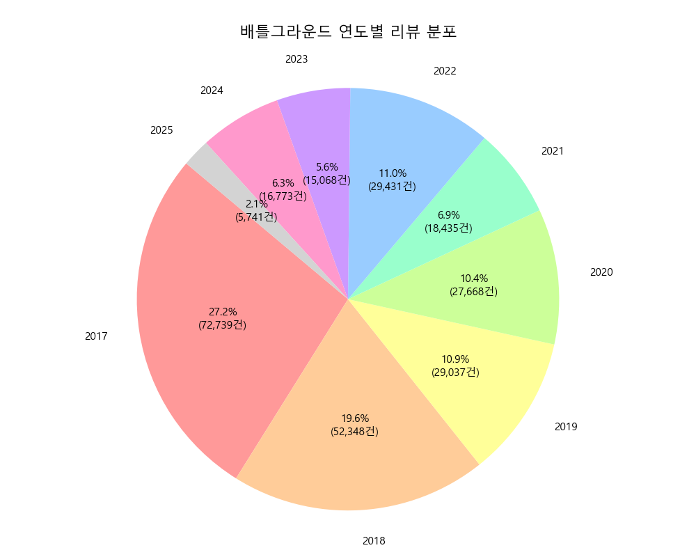
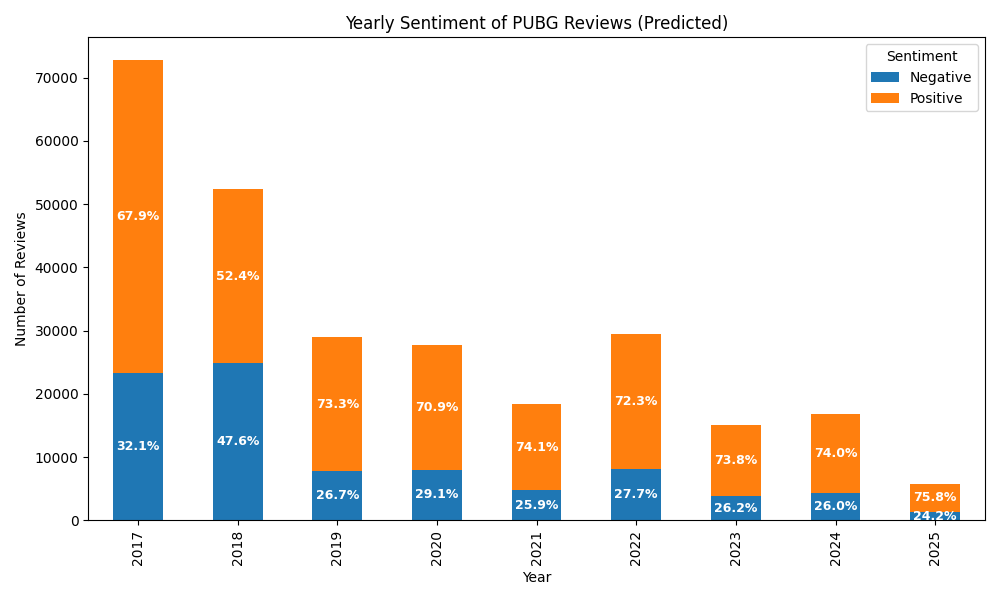
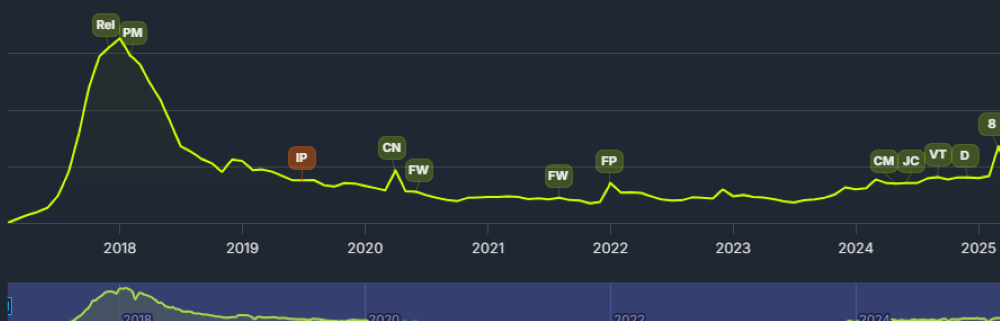

#  PUBG 리뷰 감정 분석 프로젝트 (Sentiment Analysis with MobileBERT)

> Steam 플랫폼에서 수집한 배틀그라운드(PUBG) 사용자 리뷰를 기반으로, MobileBERT 모델을 활용한 감정 분석 프로젝트입니다.
> 

---

## 1.개 요

게임은 현대 대중문화에서 가장 보편적이고 영향력 있는 콘텐츠 중 하나로 자리 잡았다. 특히 멀티플레이어 온라인 게임인 배틀그라운드(PUBG)는 전 세계적으로 수백만 명의 플레이어를 보유하며, 게임 산업에 큰 영향을 미치고 있다. [1] [참고자료](https://en.wikipedia.org/w/index.php?title=PUBG:_Battlegrounds&utm_source=)

디지털 시대에 접어들며 다양한 게임 리뷰 플랫폼이 활성화되었고, 이러한 리뷰들은 게임의 인기도와 성공 여부를 가늠하는 중요한 지표가 되었다. 유저 리뷰의 긍정 혹은 부정 감정은 게임 개발사에게 사용자 경험 개선과 콘텐츠 기획에 필수적인 정보로 활용된다.

이번 프로젝트에서는 PUBG의 사용자 리뷰 데이터를 직접 수집하여 감정 분석을 수행하고자 한다. 특히, 리뷰를 긍정과 부정으로 분류함으로써 특정 시기나 업데이트에 따른 동시접속자와 사용자 반응 변화의 관계를 파악하고, 긍정적인 리뷰가 집중되는 시점에 대한 원인 분석을 시도한다.

이를 통해 게임 운영 및 마케팅 전략 수립에 필요한 정성적 피드백을 정량화하고, 향후 게임 서비스 개선 및 유저 만족도 제고에 기여하는 것이 목표이다.

## 2. 데이터

### (1) 수집 정보
- **출처:** SteamStore 사용자 리뷰[2] [참고자료](https://store.steampowered.com/)
- **대상 게임:** PUBG
- **수집 방식:** 직접 크롤링하여 csv파일로 저장
- **사용 목적:** 감성 분류 모델 학습

### (2) 수집 방법
- **Steam API 사용(비공식방법):** 
> https://store.steampowered.com/appreviews/<APP_ID>?json=1
  

### (3) 데이터 처리
- 리뷰 텍스트와 추천 여부를 사용
- created_date를 기반으로 year 컬럼 추가
- MobileBERT 토크나이저를 활용하여 텍스트를 토큰화

### (4) EDA
-  **총 리뷰 수**: 428,196건
    + 영어 알파벳, 숫자, 공백, 일부 구두점만 허용
    + 3글자 이하 리뷰 수 삭제
    + 총 160,956건 제거

- #### 전처리 된 리뷰 수: 267,240건

- #### 라벨 분포:
  + **긍정(추천) 리뷰:** 179,435건(67.1%)
  + **부정(비추천) 리뷰:** 87,805건(32.9%)

- #### 연도별 리뷰 분포:
  

### 3. 학습데이터 구축

최종 전처리된 총 267,240건의 데이터 중 약 11%에 해당하는 30,002건을 연도별 리뷰의 비율에 맞게 추출하여 모델 학습용 데이터셋으로 활용

- **학습 데이터 수:** 30,002건
- **추천 수:** 20,194건 (67.31%)
- **비추천 수:** 9,808건 (32.69%)

### 4. MobileBERT Finetuning 결과

- 학습데이터 30,002건을 8:2로 나누어 검증데이터를 추출
- #### 모델 학습 결과 

| Epoch | Train Loss | Train Accuracy | Validation Accuracy |
|-------|------------|----------------|----------------------|
| 1     | 8555.6753  | 0.9008         | 0.8715               |
| 2     | 3.7348     | 0.9230         | 0.8795               |
| 3     | 0.8721     | 0.9360         | 0.8822               |
| 4     | 0.3002     | 0.9431         | 0.8809               |

> 모델 학습은 총 4개의 에폭(epoch) 동안 진행되었으며, 최종 검증 정확도는 88.2%를 기록했다.

### 5. 결론 및 느낀점

>#### 전체 데이터의 대한 정확도 : 88.5% 

#### 연도별 리뷰 수와 긍부정 비율

#### 배틀그라운드 동시접속자 수

본 프로젝트는 배틀그라운드 리뷰 데이터를 활용한 감정 분석 과제로, 최근 배틀그라운드의 동시접속자 수 증가 현상에 주목하여 진행했다.
일반적으로 동시접속자의 증가는 게임에 대한 긍정적인 평가(예: 성공적인 업데이트, 밸런스 패치 등)를 의미한다고 가정하고, 연도별 리뷰 감정 분석을 통해 긍정 리뷰 비율의 변화를 관찰했다.

그러나 분석 결과, 동시접속자 수가 증가한 시기에도 긍정 리뷰의 비율은 함께 증가하지 않았으며, 오히려 감정 분포는 일정하거나 부정 리뷰 비중이 유지되는 경향을 보였다.
이는 사용자 유입 증가가 반드시 리뷰의 긍정 감정 증가로 이어지지 않음을 시사하며, 게임 외부 요인(이벤트, 마케팅 등) 이 사용자 수와 리뷰 감정 간의 상관관계에 영향을 미쳤을 가능성을 보여준다.

반면, 동시접속자 수가 적은 시기에는 긍정 리뷰 비율이 상대적으로 높게 나타나는 현상도 확인할 수 있었다.
이 점은 처음에는 쉽게 예상하지 못했던 부분인데, 분석을 통해 해당 시기에 게임을 이용하는 사용자가 대부분 높은 충성도를 가진 핵심 유저층임을 알게 되었다.
이들이 자발적으로 긍정적인 피드백을 남긴 결과라고 해석할 수 있으며, 부정적인 의견을 가진 사용자들은 이미 이탈했을 가능성이 높아, 잔존 유저의 긍정적인 관점이 더욱 많이 반영된 결과임을 확인할 수 있었다. [3][참고자료](https://arxiv.org/abs/1703.03386)

    